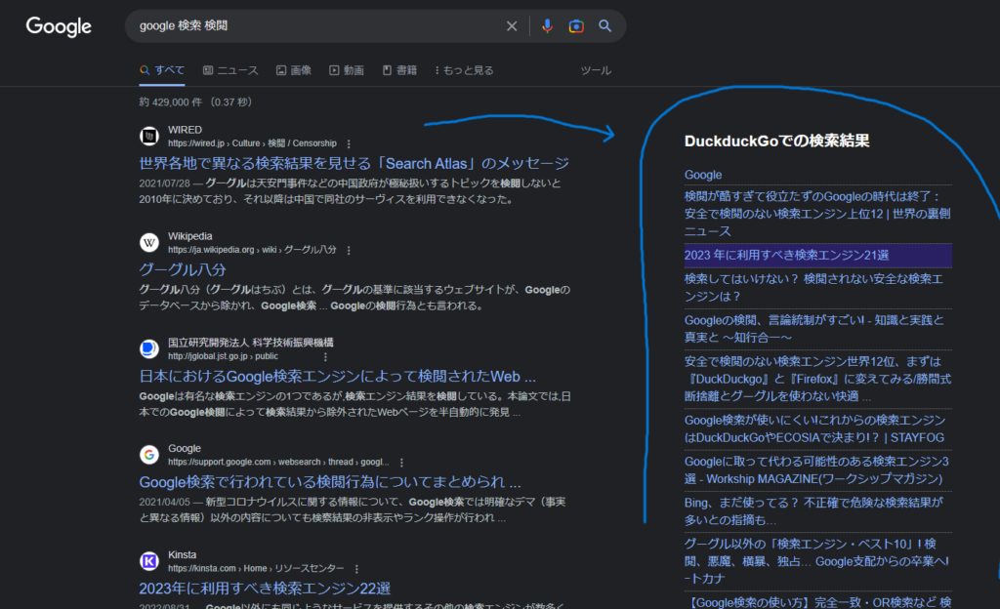

# google-search-with-duckduckgo
 Display duckduckgo search results in google search engine results at the same time.
 
# Overview
 This extension displays the search results from DuckduckGo together on the Google search results page.
This extension is useful for quickly finding pages or more minor blog posts that may be caught by information censorship while still using the high-performance Google search.
If you normally use both Google search and DuckduckGo search while switching between the two, why not try it?

A list of DuckduckGo search results is displayed on the right side of the screen, and if the same link is found in both results, the background of the link will be colored.

# Screenshot
